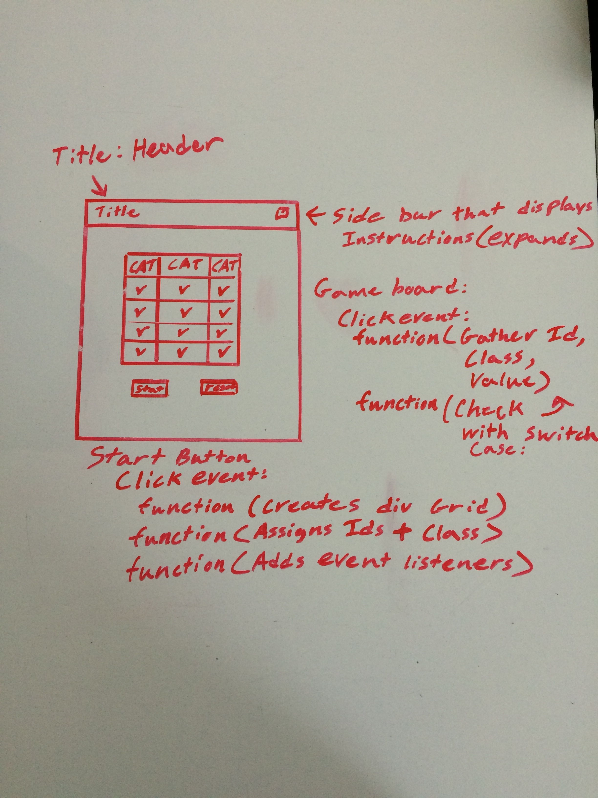
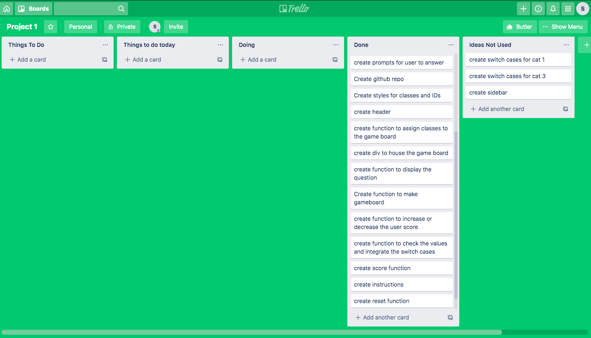

Overview
I chose to create Automotive Jeopardy as my first project. 
My goal for this project was to prioritize JavaScript functions and use over HTML and CSS.

How it works

There is a start and reset button. 
When pressed the start button will create the game board. 
The player then chooses a category and point value. 
Based on the user's selection a question and three multiple choice answers appear. 
If the user guesses the correct answer the point value will be added to their score. 
If the user does not guess the correct answer, then those points will be deducted from their score. 
The game ends when all questions are answered. They will win if their score is over 2000. 

Live site: https://master.d1a3wku9xuehdn.amplifyapp.com/

Technologies Used
Languages - HTML5, CSS3, Javascript
Design - Google Fonts, Bootstrap, Sweet Alerts
Project Planning & Text Editor - Trello and Visual Studios Code

WireFrame

Trello

